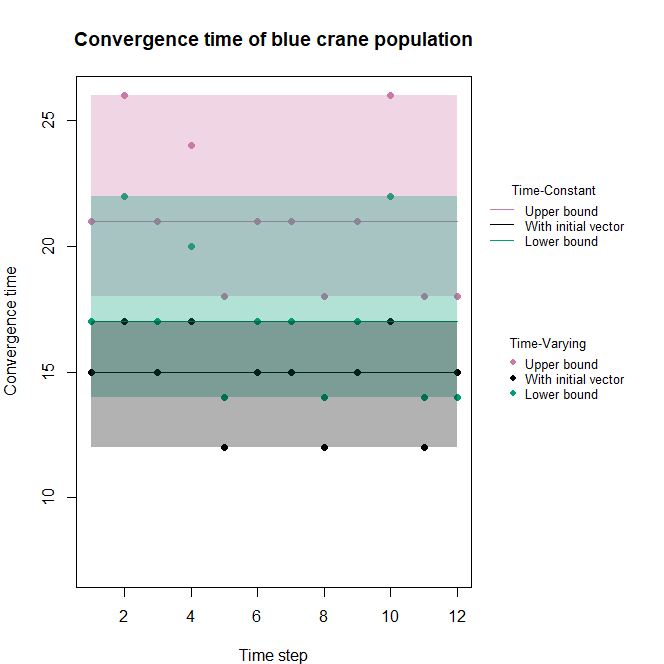
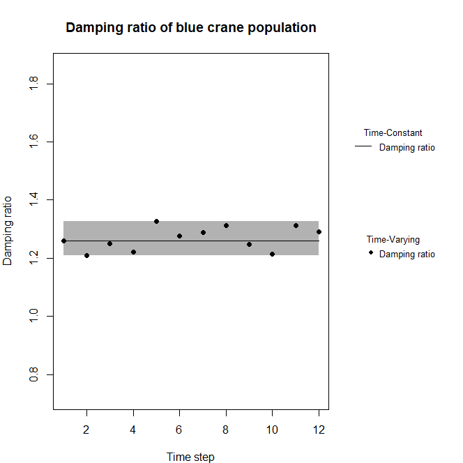
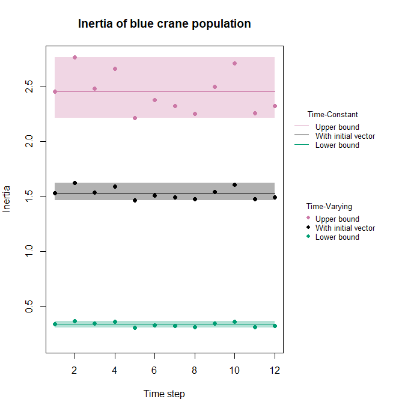
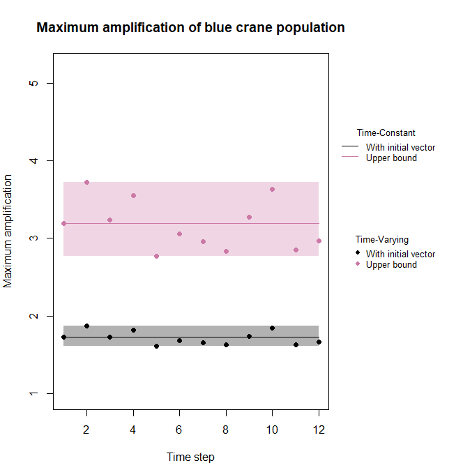
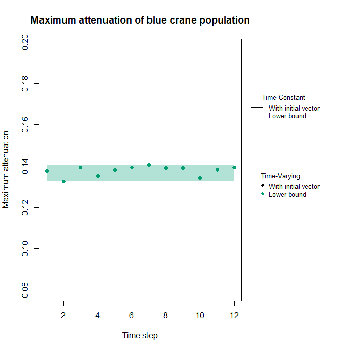
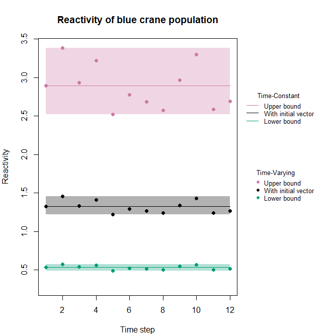

---
output:
  md_document:
    variant: markdown_github
editor_options: 
  chunk_output_type: console
---

<!-- README.md is generated from README.Rmd. Please edit that file -->

```{r, setup, include = FALSE}
knitr::opts_chunk$set(
  collapse = TRUE,
  comment = "#>"
)
```

# demres

The goal of __{demres}__ is to provide easy functions to calculate different time-varying and time-constant demographic resilience metrics. It also allows plotting the resulting metrics and measuring the discrepancy between the time-varying and the time-constant approach. 

The different metrics provided are:   
- Convergence time    
- Damping ratio    
- Inertia  
- Reactivity   
- Maximum amplification   
- Maximum attenuation   

It is build around one (direct) dependency:

- [__{popdemo}__](https://github.com/iainmstott/popdemo)

__{demres}__ aims at being compatible with both _tidyverse_ and _base_ R dialects.

## Package installation

You can install this package using __{remotes}__ (or __{devtools}__):

```{r, installation, eval = FALSE}
remotes::install_github("JulieLouvrier/demres")

```

## Basic usage of the package
### Load the package {demres}

```{r, loading pkg}
library(demres)
```

### Import Matrix Population Models 
```{r, import data}
# load data
data(bluecrane)

```

### Calculate demographic resilience metrics based on a list of population matrices

The function `resilience` is made to calculate demographic resilience metrics based on a list of matrix projection models. It returns a `dataframe` with both time-varying and time-constant approaches when requested using the argument `time`.

```{r, resilience metrics}
# Create initial vector
set.seed(1234)
Cranevec1 <- runif(5)
Cranevec1 <- Cranevec1 / sum(Cranevec1) #scales the vector to sum to 1

#let's calculate all metrics of demographic resilience for that one matrix with one initial vector
BlueCrane_demres <- resilience(
    listA = bluecrane,
    metrics = "all",
    bounds = TRUE,
    vector = Cranevec1,
    TDvector = TRUE,
    popname = "blue crane",
    time = "both",
    verbose = TRUE)

#let's take a look at what we got
BlueCrane_demres
```

### Assess the distance between the time-varying and the time-constant approaches

The function `summary` calculates the distance between the time-varying and the time-constant approaches by using the RMSE, rRMSE or the MAPE: 

#### RMSE: 
$$\sqrt{mean((TV-TC)^2)}$$   
with TV - the time-varying resilience metric and TC - the time-constant one

#### rRMSE: 
$$\sqrt{mean((TV-TC)^2)} / sd(TV)$$   

#### MAPE: 
$$\frac{mean(abs(TV-TC))}{TC}$$ 

```{r, distance}
#let's calculate all measures of distance for inertia
dist_BC <- summary(BlueCrane_demres)

#let's take a look at what we got
dist_BC
```

### Plot the results

Function `plot` provides a plot to visually inspect the resilience metric along a time axis

```{r, plotting}
plot(BlueCrane_demres)
```












