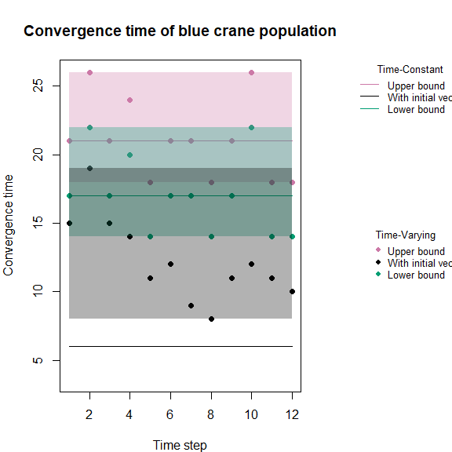
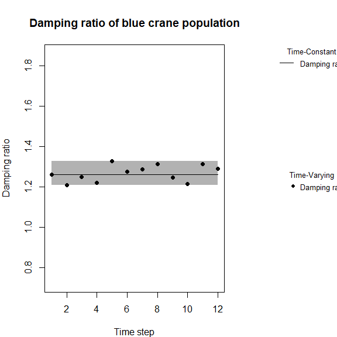
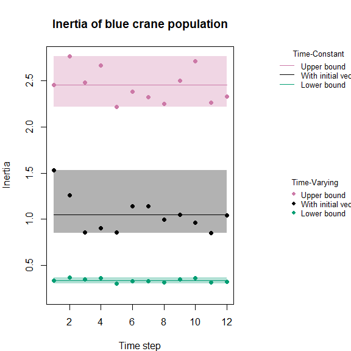
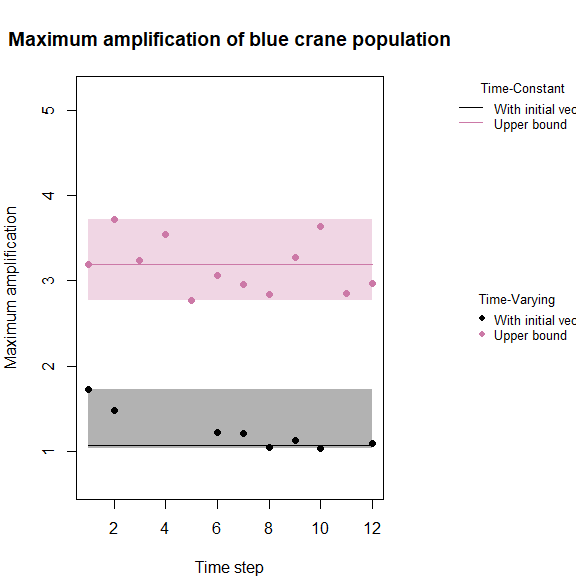
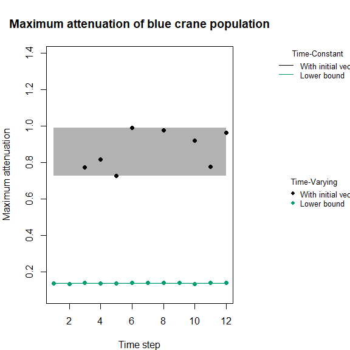
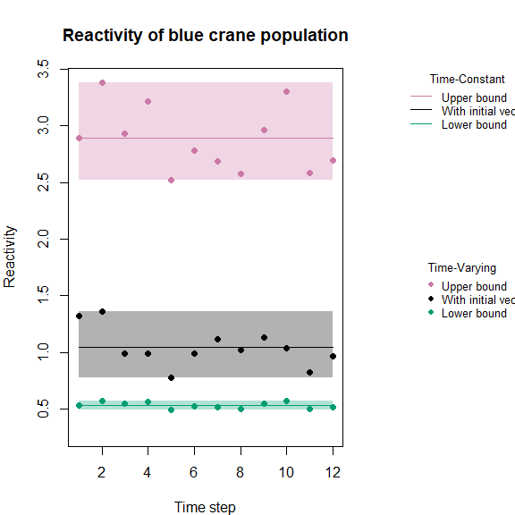

<!-- README.md is generated from README.Rmd. Please edit that file -->

# demres

The goal of **{demres}** is to provide easy functions to calculate
different time-varying and time-constant demographic resilience metrics.
It also allows plotting the resulting metrics and measuring the
discrepancy between the time-varying and the time-constant approach.

The different metrics provided are:  
- Convergence time  
- Damping ratio  
- Inertia  
- Reactivity  
- Maximum amplification  
- Maximum attenuation

It is build around one (direct) dependency:

- [**{popdemo}**](https://github.com/iainmstott/popdemo)

**{demres}** aims at being compatible with both *tidyverse* and *base* R
dialects.

## Package installation

You can install this package using **{remotes}** (or **{devtools}**):

``` r
remotes::install_github("ANONYMOUS/demres")
```

## Basic usage of the package

### Load the package {demres}

``` r
library(demres)
```

### Import Matrix Population Models

``` r
# load data
data(bluecrane)
```

### Calculate demographic resilience metrics based on a list of population matrices

The function `resilience` is made to calculate demographic resilience
metrics based on a list of matrix projection models. It returns a
`dataframe` with both time-varying and time-constant approaches when
requested using the argument `time`.

``` r
# Create initial vector
set.seed(1234)
Cranevec1 <- runif(5)
Cranevec1 <- Cranevec1 / sum(Cranevec1) #scales the vector to sum to 1

#let's calculate all metrics of demographic resilience for that one matrix with one initial vector
BlueCrane_demres <- resilience(
    listA = bluecrane,
    metrics = "all",
    bounds = TRUE,
    vector = Cranevec1,
    TDvector = TRUE,
    popname = "blue crane",
    time = "both",
    verbose = TRUE)
#>                                                                                                          Message for time-varying resilience at time step 1
#> 1 The lower bound of maximum amplification cannot be computed. Therefore, the lower maximum attenuation is calculated using the default stage biased vector
#> 2                                            Model does not attenuate.  Cannot compute maximum attenuation with the stated initial vector, Na is displayed 
#> 3 The upper bound of maximum attenuation cannot be computed. Therefore, the upper maximum amplification is calculated using the default stage biased vector
#>                                                                                                          Message for time-varying resilience at time step 2
#> 1 The lower bound of maximum amplification cannot be computed. Therefore, the lower maximum attenuation is calculated using the default stage biased vector
#> 2                                            Model does not attenuate.  Cannot compute maximum attenuation with the stated initial vector, Na is displayed 
#> 3 The upper bound of maximum attenuation cannot be computed. Therefore, the upper maximum amplification is calculated using the default stage biased vector
#>                                                                                                          Message for time-varying resilience at time step 3
#> 1                                             Model does not amplify. Cannot compute maximum amplification with the stated initial vector, Na is displayed 
#> 2 The lower bound of maximum amplification cannot be computed. Therefore, the lower maximum attenuation is calculated using the default stage biased vector
#> 3 The upper bound of maximum attenuation cannot be computed. Therefore, the upper maximum amplification is calculated using the default stage biased vector
#>                                                                                                          Message for time-varying resilience at time step 4
#> 1                                             Model does not amplify. Cannot compute maximum amplification with the stated initial vector, Na is displayed 
#> 2 The lower bound of maximum amplification cannot be computed. Therefore, the lower maximum attenuation is calculated using the default stage biased vector
#> 3 The upper bound of maximum attenuation cannot be computed. Therefore, the upper maximum amplification is calculated using the default stage biased vector
#>                                                                                                          Message for time-varying resilience at time step 5
#> 1                                             Model does not amplify. Cannot compute maximum amplification with the stated initial vector, Na is displayed 
#> 2 The lower bound of maximum amplification cannot be computed. Therefore, the lower maximum attenuation is calculated using the default stage biased vector
#> 3 The upper bound of maximum attenuation cannot be computed. Therefore, the upper maximum amplification is calculated using the default stage biased vector
#>                                                                                                          Message for time-varying resilience at time step 6
#> 1 The lower bound of maximum amplification cannot be computed. Therefore, the lower maximum attenuation is calculated using the default stage biased vector
#> 2 The upper bound of maximum attenuation cannot be computed. Therefore, the upper maximum amplification is calculated using the default stage biased vector
#> 3                                                                                                                                                          
#>                                                                                                          Message for time-varying resilience at time step 7
#> 1 The lower bound of maximum amplification cannot be computed. Therefore, the lower maximum attenuation is calculated using the default stage biased vector
#> 2                                            Model does not attenuate.  Cannot compute maximum attenuation with the stated initial vector, Na is displayed 
#> 3 The upper bound of maximum attenuation cannot be computed. Therefore, the upper maximum amplification is calculated using the default stage biased vector
#>                                                                                                          Message for time-varying resilience at time step 8
#> 1 The lower bound of maximum amplification cannot be computed. Therefore, the lower maximum attenuation is calculated using the default stage biased vector
#> 2 The upper bound of maximum attenuation cannot be computed. Therefore, the upper maximum amplification is calculated using the default stage biased vector
#> 3                                                                                                                                                          
#>                                                                                                          Message for time-varying resilience at time step 9
#> 1 The lower bound of maximum amplification cannot be computed. Therefore, the lower maximum attenuation is calculated using the default stage biased vector
#> 2                                            Model does not attenuate.  Cannot compute maximum attenuation with the stated initial vector, Na is displayed 
#> 3 The upper bound of maximum attenuation cannot be computed. Therefore, the upper maximum amplification is calculated using the default stage biased vector
#>                                                                                                         Message for time-varying resilience at time step 10
#> 1 The lower bound of maximum amplification cannot be computed. Therefore, the lower maximum attenuation is calculated using the default stage biased vector
#> 2 The upper bound of maximum attenuation cannot be computed. Therefore, the upper maximum amplification is calculated using the default stage biased vector
#> 3                                                                                                                                                          
#>                                                                                                         Message for time-varying resilience at time step 11
#> 1                                             Model does not amplify. Cannot compute maximum amplification with the stated initial vector, Na is displayed 
#> 2 The lower bound of maximum amplification cannot be computed. Therefore, the lower maximum attenuation is calculated using the default stage biased vector
#> 3 The upper bound of maximum attenuation cannot be computed. Therefore, the upper maximum amplification is calculated using the default stage biased vector
#>                                                                                                         Message for time-varying resilience at time step 12
#> 1 The lower bound of maximum amplification cannot be computed. Therefore, the lower maximum attenuation is calculated using the default stage biased vector
#> 2 The upper bound of maximum attenuation cannot be computed. Therefore, the upper maximum amplification is calculated using the default stage biased vector
#> 3                                                                                                                                                          
#>                                                                                                                        Message for time-constant resilience
#> 1 The lower bound of maximum amplification cannot be computed. Therefore, the lower maximum attenuation is calculated using the default stage biased vector
#> 2                                            Model does not attenuate.  Cannot compute maximum attenuation with the stated initial vector, Na is displayed 
#> 3 The upper bound of maximum attenuation cannot be computed. Therefore, the upper maximum amplification is calculated using the default stage biased vector

#let's take a look at what we got
BlueCrane_demres
#>    timestep    popname convt_TV convt_lwr_TV convt_upr_TV    dr_TV inertia_TV
#> 1         1 blue crane       15           17           21 1.260737  1.5333348
#> 2         2 blue crane       19           22           26 1.209277  1.2582784
#> 3         3 blue crane       15           17           21 1.250912  0.8581260
#> 4         4 blue crane       14           20           24 1.222042  0.9013004
#> 5         5 blue crane       11           14           18 1.327353  0.8586647
#> 6         6 blue crane       12           17           21 1.275744  1.1426049
#> 7         7 blue crane        9           17           21 1.288798  1.1378826
#> 8         8 blue crane        8           14           18 1.313330  0.9984802
#> 9         9 blue crane       11           17           21 1.247210  1.0452734
#> 10       10 blue crane       12           22           26 1.214877  0.9643615
#> 11       11 blue crane       11           14           18 1.312434  0.8513696
#> 12       12 blue crane       10           14           18 1.290253  1.0436617
#>    inertia_lwr_TV inertia_upr_TV maxamp_TV maxamp_upr_TV maxatt_TV
#> 1       0.3380643       2.453536  1.723496      3.188589        NA
#> 2       0.3664144       2.764719  1.480409      3.722920        NA
#> 3       0.3457900       2.481637        NA      3.238037 0.7740310
#> 4       0.3601647       2.662348        NA      3.548079 0.8186359
#> 5       0.3058453       2.216446        NA      2.770840 0.7270000
#> 6       0.3315223       2.380029  1.216825      3.061100 0.9894003
#> 7       0.3262064       2.321470  1.206248      2.959427        NA
#> 8       0.3128593       2.252394  1.043203      2.835762 0.9786728
#> 9       0.3477418       2.500855  1.133028      3.271153        NA
#> 10      0.3642050       2.713575  1.039046      3.635428 0.9224155
#> 11      0.3126440       2.259734        NA      2.848023 0.7762351
#> 12      0.3241436       2.326127  1.090320      2.966458 0.9626888
#>    maxatt_lwr_TV   reac_TV reac_lwr_TV reac_upr_TV convt_TC convt_lwr_TC
#> 1      0.1377865 1.3230440   0.5324434    2.895077        6           17
#> 2      0.1325322 1.3618635   0.5723503    3.382101        6           17
#> 3      0.1393395 0.9860133   0.5436130    2.935359        6           17
#> 4      0.1352809 0.9876613   0.5634825    3.219720        6           17
#> 5      0.1379891 0.7728866   0.4907642    2.518515        6           17
#> 6      0.1392934 0.9894003   0.5239987    2.778008        6           17
#> 7      0.1405172 1.1160518   0.5173623    2.684792        6           17
#> 8      0.1389008 1.0228788   0.4997366    2.576003        6           17
#> 9      0.1390491 1.1330283   0.5462951    2.965338        6           17
#> 10     0.1342159 1.0390461   0.5693033    3.299575        6           17
#> 11     0.1383543 0.8256561   0.4992444    2.587806        6           17
#> 12     0.1393490 0.9626888   0.5142661    2.693034        6           17
#>    convt_upr_TC    dr_TC inertia_TC inertia_lwr_TC inertia_upr_TC maxamp_TC
#> 1            21 1.260737   1.048844      0.3380642       2.453536  1.067201
#> 2            21 1.260737   1.048844      0.3380642       2.453536  1.067201
#> 3            21 1.260737   1.048844      0.3380642       2.453536  1.067201
#> 4            21 1.260737   1.048844      0.3380642       2.453536  1.067201
#> 5            21 1.260737   1.048844      0.3380642       2.453536  1.067201
#> 6            21 1.260737   1.048844      0.3380642       2.453536  1.067201
#> 7            21 1.260737   1.048844      0.3380642       2.453536  1.067201
#> 8            21 1.260737   1.048844      0.3380642       2.453536  1.067201
#> 9            21 1.260737   1.048844      0.3380642       2.453536  1.067201
#> 10           21 1.260737   1.048844      0.3380642       2.453536  1.067201
#> 11           21 1.260737   1.048844      0.3380642       2.453536  1.067201
#> 12           21 1.260737   1.048844      0.3380642       2.453536  1.067201
#>    maxamp_upr_TC maxatt_TC maxatt_lwr_TC  reac_TC reac_lwr_TC reac_upr_TC
#> 1       3.188589        NA     0.1377865 1.041294   0.5324433    2.895078
#> 2       3.188589        NA     0.1377865 1.041294   0.5324433    2.895078
#> 3       3.188589        NA     0.1377865 1.041294   0.5324433    2.895078
#> 4       3.188589        NA     0.1377865 1.041294   0.5324433    2.895078
#> 5       3.188589        NA     0.1377865 1.041294   0.5324433    2.895078
#> 6       3.188589        NA     0.1377865 1.041294   0.5324433    2.895078
#> 7       3.188589        NA     0.1377865 1.041294   0.5324433    2.895078
#> 8       3.188589        NA     0.1377865 1.041294   0.5324433    2.895078
#> 9       3.188589        NA     0.1377865 1.041294   0.5324433    2.895078
#> 10      3.188589        NA     0.1377865 1.041294   0.5324433    2.895078
#> 11      3.188589        NA     0.1377865 1.041294   0.5324433    2.895078
#> 12      3.188589        NA     0.1377865 1.041294   0.5324433    2.895078
```

### Assess the distance between the time-varying and the time-constant approaches

The function `summary` calculates the distance between the time-varying
and the time-constant approaches by using the RMSE, rRMSE or the MAPE:

#### RMSE:

$$\sqrt{mean((TV-TC)^2)}$$

with TV - the time-varying resilience metric and TC - the time-constant
one

#### rRMSE:

$$\sqrt{mean((TV-TC)^2)} / sd(TV)$$

#### MAPE:

$$\frac{mean(abs(TV-TC))}{TC}$$

``` r
#let's calculate all measures of distance for inertia
dist_BC <- summary(BlueCrane_demres)

#let's take a look at what we got
dist_BC
#>          convt convt_lwr  convt_upr         dr   inertia inertia_lwr
#> RMSE  6.898067 2.8136572 2.81365717 0.03903875 0.1911224  0.02005321
#> rRMSE 2.262518 0.9578473 0.95784731 0.97324861 0.9574318  0.96115364
#> MAPE  1.041667 0.1225490 0.09920635 0.02662846 0.1387432  0.05155810
#>       inertia_upr    maxamp maxamp_upr maxatt maxatt_lwr      reac   reac_lwr
#> RMSE   0.17897716 0.2849170 0.31047904    NaN 0.00231687 0.1657916 0.02703314
#> rRMSE  0.95867538 1.1827921 0.95905906    NaN 0.95785432 0.9575008 0.95866190
#> MAPE   0.06183159 0.1756083 0.08265399    NaN 0.01320329 0.1210779 0.04415418
#>         reac_upr
#> RMSE  0.28129654
#> rRMSE 0.95920804
#> MAPE  0.08229525
```

### Plot the results

Function `plot` provides a plot to visually inspect the resilience
metric along a time axis

``` r
plot(BlueCrane_demres)
```

<!-- --><!-- --><!-- --><!-- --><!-- --><!-- -->
