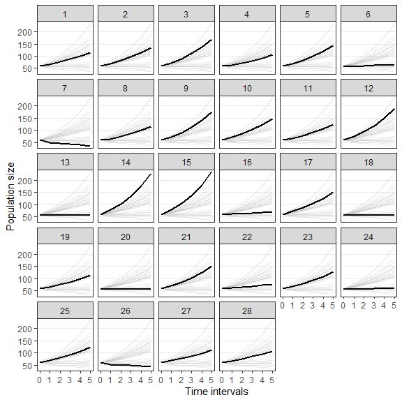
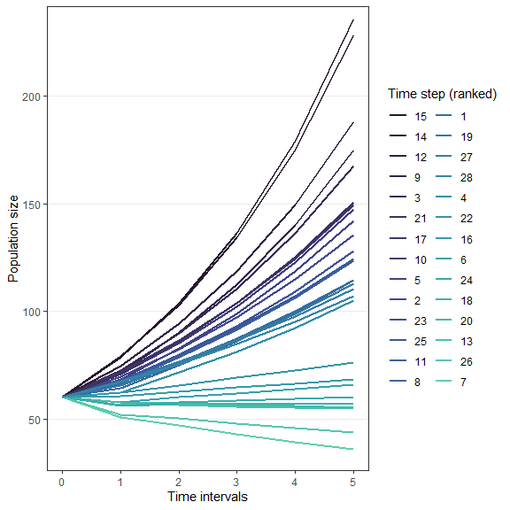
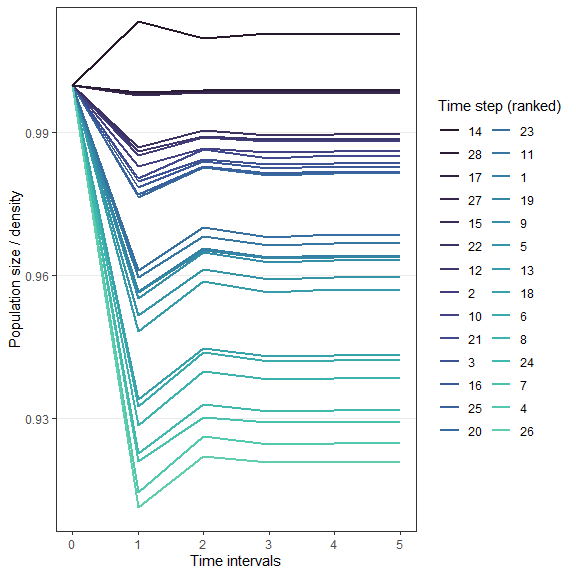

<!-- README.md is generated from README.Rmd. Please edit that file -->

# demres

The goal of **{demres}** is to provide easy functions to calculate
different time-varying and time-constant demographic resilience metrics.
It also allows plotting the resulting metrics and measuring the
discrepancy between the time-varying and the time-constant approach.

The different metrics provided are:  
- Convergence time  
- Damping ratio  
- Reactivity  
- Maximum amplification  
- Maximum attenuation

It is build around one (direct) dependency:

- [**{popdemo}**](https://github.com/iainmstott/popdemo)

**{demres}** aims at being compatible with both *tidyverse* and *base* R
dialects.

## Package installation

You can install this package using **{remotes}** (or **{devtools}**):

``` r
remotes::install_github("JulieLouvrier/demres@V1.1")
```

## Basic usage of the package

### Load the package {demres}

``` r
library(demres)
```

### Import Matrix Population Models

``` r
# load data
data(adeliepenguin)
```

### Calculate demographic resilience metrics based on a list of population matrices

The function `resilience` is made to calculate demographic resilience
metrics based on a list of matrix projection models. It returns a
`dataframe` with both time-varying and time-constant approaches when
requested using the argument `time`.

``` r
# Create initial vector
set.seed(125435)
vec <- round(runif(2) * 100 )
vector_list <- lapply(1:28, function(i) vec)

#let's calculate all metrics of demographic resilience for with one initial vector
AP_demres <-
   resilience(
     listA = adeliepenguin,
     metrics = "all",
     vector = vector_list,
     TDvector = FALSE,
     popname = "adelie penguin",
     verbose = TRUE,
     return.N = TRUE,
     return.t = TRUE
   )
#>                                                                                                                                                                  
#> Message for resilience calculated at time step 1   Model does not amplify. Cannot compute maximum amplification with the stated initial vector, Na is displayed  
#> Message for resilience calculated at time step 2   Model does not amplify. Cannot compute maximum amplification with the stated initial vector, Na is displayed  
#> Message for resilience calculated at time step 3   Model does not amplify. Cannot compute maximum amplification with the stated initial vector, Na is displayed  
#> Message for resilience calculated at time step 4   Model does not amplify. Cannot compute maximum amplification with the stated initial vector, Na is displayed  
#> Message for resilience calculated at time step 5   Model does not amplify. Cannot compute maximum amplification with the stated initial vector, Na is displayed  
#> Message for resilience calculated at time step 6   Model does not amplify. Cannot compute maximum amplification with the stated initial vector, Na is displayed  
#> Message for resilience calculated at time step 7   Model does not amplify. Cannot compute maximum amplification with the stated initial vector, Na is displayed  
#> Message for resilience calculated at time step 8   Model does not amplify. Cannot compute maximum amplification with the stated initial vector, Na is displayed  
#> Message for resilience calculated at time step 9   Model does not amplify. Cannot compute maximum amplification with the stated initial vector, Na is displayed  
#> Message for resilience calculated at time step 10  Model does not amplify. Cannot compute maximum amplification with the stated initial vector, Na is displayed  
#> Message for resilience calculated at time step 11  Model does not amplify. Cannot compute maximum amplification with the stated initial vector, Na is displayed  
#> Message for resilience calculated at time step 12  Model does not amplify. Cannot compute maximum amplification with the stated initial vector, Na is displayed  
#> Message for resilience calculated at time step 13  Model does not amplify. Cannot compute maximum amplification with the stated initial vector, Na is displayed  
#> Message for resilience calculated at time step 14  Model does not attenuate.  Cannot compute maximum attenuation with the stated initial vector, Na is displayed 
#> Message for resilience calculated at time step 15  Model does not amplify. Cannot compute maximum amplification with the stated initial vector, Na is displayed  
#> Message for resilience calculated at time step 16  Model does not amplify. Cannot compute maximum amplification with the stated initial vector, Na is displayed  
#> Message for resilience calculated at time step 17  Model does not amplify. Cannot compute maximum amplification with the stated initial vector, Na is displayed  
#> Message for resilience calculated at time step 18  Model does not amplify. Cannot compute maximum amplification with the stated initial vector, Na is displayed  
#> Message for resilience calculated at time step 19  Model does not amplify. Cannot compute maximum amplification with the stated initial vector, Na is displayed  
#> Message for resilience calculated at time step 20  Model does not amplify. Cannot compute maximum amplification with the stated initial vector, Na is displayed  
#> Message for resilience calculated at time step 21  Model does not amplify. Cannot compute maximum amplification with the stated initial vector, Na is displayed  
#> Message for resilience calculated at time step 22  Model does not amplify. Cannot compute maximum amplification with the stated initial vector, Na is displayed  
#> Message for resilience calculated at time step 23  Model does not amplify. Cannot compute maximum amplification with the stated initial vector, Na is displayed  
#> Message for resilience calculated at time step 24  Model does not amplify. Cannot compute maximum amplification with the stated initial vector, Na is displayed  
#> Message for resilience calculated at time step 25  Model does not amplify. Cannot compute maximum amplification with the stated initial vector, Na is displayed  
#> Message for resilience calculated at time step 26  Model does not amplify. Cannot compute maximum amplification with the stated initial vector, Na is displayed  
#> Message for resilience calculated at time step 27  Model does not amplify. Cannot compute maximum amplification with the stated initial vector, Na is displayed  
#> Message for resilience calculated at time step 28  Model does not amplify. Cannot compute maximum amplification with the stated initial vector, Na is displayed

#let's take a look at what we got
AP_demres
#>    timestep        popname convt convt.N       dr maxamp maxamp.t maxatt
#> 1         1 adelie penguin     2 65.8200 4.844809     NA       NA  65.82
#> 2         2 adelie penguin     2 69.7500 3.934655     NA       NA  69.75
#> 3         3 adelie penguin     2 72.4500 4.363470     NA       NA  72.45
#> 4         4 adelie penguin     3 71.6838 7.288792     NA       NA  62.31
#> 5         5 adelie penguin     3 82.7760 5.032717     NA       NA  68.40
#> 6         6 adelie penguin     3 60.1974 6.026819     NA       NA  57.69
#> 7         7 adelie penguin     2 50.6400 8.606140     NA       NA  50.64
#> 8         8 adelie penguin     3 74.9571 6.302694     NA       NA  64.23
#> 9         9 adelie penguin     3 90.1536 4.657293     NA       NA  71.52
#> 10       10 adelie penguin     2 70.8000 4.608732     NA       NA  70.80
#> 11       11 adelie penguin     2 66.9900 4.779472     NA       NA  66.99
#> 12       12 adelie penguin     2 74.5500 4.500000     NA       NA  74.55
#> 13       13 adelie penguin     3 56.4126 4.943374     NA       NA  56.34
#> 14       14 adelie penguin     2 79.2600 3.907040  79.26        1     NA
#> 15       15 adelie penguin     1 60.0000 3.922862     NA       NA  78.75
#> 16       16 adelie penguin     2 60.5100 3.952740     NA       NA  60.51
#> 17       17 adelie penguin     1 60.0000 3.632194     NA       NA  71.91
#> 18       18 adelie penguin     3 56.9244 6.180351     NA       NA  56.16
#> 19       19 adelie penguin     2 65.6100 4.899730     NA       NA  65.61
#> 20       20 adelie penguin     2 57.8400 3.692842     NA       NA  57.84
#> 21       21 adelie penguin     2 70.9500 3.205801     NA       NA  70.95
#> 22       22 adelie penguin     2 62.2800 3.732414     NA       NA  62.28
#> 23       23 adelie penguin     2 67.5300 4.320532     NA       NA  67.53
#> 24       24 adelie penguin     3 57.6108 7.540645     NA       NA  56.16
#> 25       25 adelie penguin     2 68.0700 3.854944     NA       NA  68.07
#> 26       26 adelie penguin     3 50.2956 8.396133     NA       NA  52.14
#> 27       27 adelie penguin     1 60.0000 3.226423     NA       NA  67.68
#> 28       28 adelie penguin     1 60.0000 3.966774     NA       NA  67.29
#>    maxatt.t  reac reac.t
#> 1         1 65.82      1
#> 2         1 69.75      1
#> 3         1 72.45      1
#> 4         1 62.31      1
#> 5         1 68.40      1
#> 6         1 57.69      1
#> 7         1 50.64      1
#> 8         1 64.23      1
#> 9         1 71.52      1
#> 10        1 70.80      1
#> 11        1 66.99      1
#> 12        1 74.55      1
#> 13        1 56.34      1
#> 14       NA 79.26      1
#> 15        1 78.75      1
#> 16        1 60.51      1
#> 17        1 71.91      1
#> 18        1 56.16      1
#> 19        1 65.61      1
#> 20        1 57.84      1
#> 21        1 70.95      1
#> 22        1 62.28      1
#> 23        1 67.53      1
#> 24        1 56.16      1
#> 25        1 68.07      1
#> 26        1 52.14      1
#> 27        1 67.68      1
#> 28        1 67.29      1
```

### Assess the distance between the time-varying and the time-constant approaches

The function `summary` calculates the variation in the time-varying
metrics:

``` r
#let's calculate the default variation measures, namely mean and sd 
summary_AP <- summary(AP_demres)

#let's take a look at what we got
summary_AP
#>               mean        sd
#> convt     2.178571 0.6696362
#> convt.N  65.859332 9.3337207
#> dr        4.940014 1.4940121
#> maxamp   79.260000        NA
#> maxamp.t  1.000000        NA
#> maxatt   64.976667 7.0857343
#> maxatt.t  1.000000 0.0000000
#> reac     65.486786 7.4588397
```

### Plot the results

Function `plot` provides a plot to visually inspect the resilience
metric along a time axis

``` r
plot(AP_demres,
     listA = adeliepenguin,
     vector = vector_list,
     timeproj = 5,
     sort = FALSE,
     compare = TRUE)
```

<!-- -->

``` r

 # One plot to compare them all together
 plot(AP_demres,
     listA = adeliepenguin,
     vector = vector_list,
     timeproj = 5,
     sort = TRUE,
     compare = TRUE,
     facet = FALSE)
```

<!-- -->

``` r
     
 # Compare with the standardized value
plot(AP_demres,
     listA = adeliepenguin,
     vector = vector_list,
     timeproj = 5,
     standard.A = TRUE,
     standard.vec = TRUE,
     sort = TRUE,
     compare = TRUE,
     facet = FALSE)
```

<!-- -->
