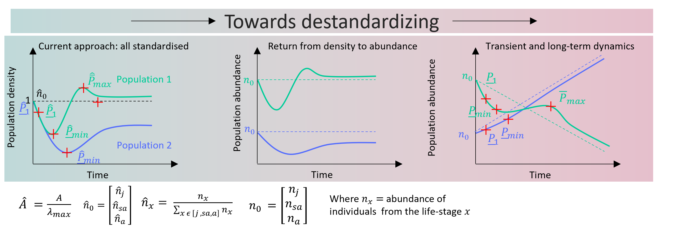
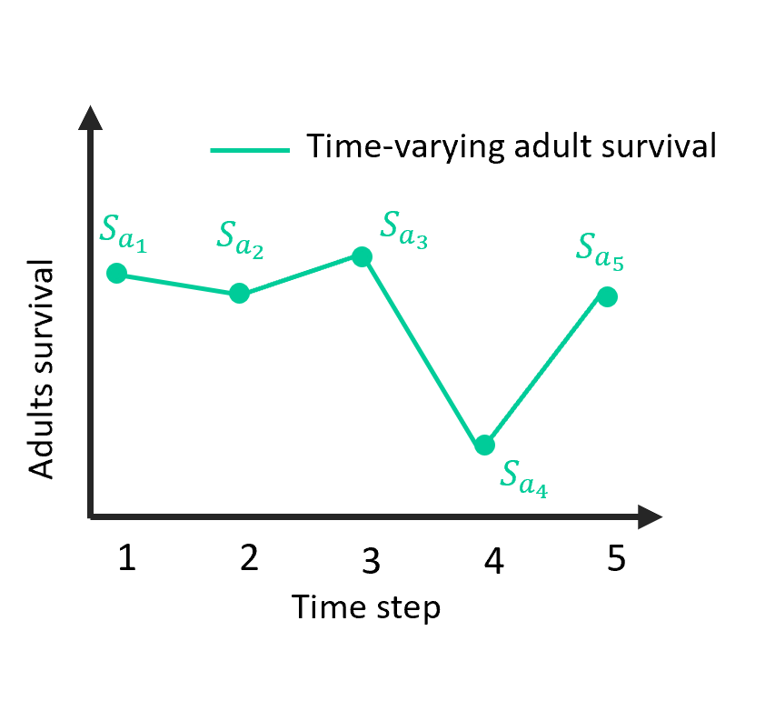
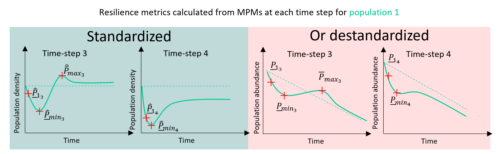

```{r, include = FALSE}
knitr::opts_chunk$set(echo = TRUE, comment = "##  ", collapse = TRUE, fig.align = "center", out.width="60%")
library(demres)
options(digits = 4)
```

The goal of `demres` is to provide functions to calculate a set of time-varying demographic resilience metrics. It also allows plotting the metrics and measuring the variability in the time-varying metrics. 

The different metrics provided are:   
- _Convergence time_    
- _Damping ratio_    
- _Maximum amplification_   
- _Maximum attenuation_   
- _Reactivity_   
- _Time to target_

It is build around one dependency:

- [`popdemo`](https://github.com/iainmstott/popdemo)

`demres` aims at being compatible with both _tidyverse_ and _base_ R dialects.

***
# Installing `demres`
`demres` is available on [GitHub](https://github.com/JulieLouvrier/demres). 
Running vignette requires the latest version of the package. 

## Package installation from Github

You can install this package using `remotes` (or `devtools`):

```{r, installation, eval = FALSE}
# Install dependencies from CRAN:
install.packages(c("devtools", "remotes"))

# Installing from GitHub
remotes::install_github("JulieLouvrier/demres@V1.1")

```
***  

# Introduction to the demres framework

Demographic resilience has been defined as "the ability of populations to resist and recover from perturbations that alter their demographic structure" (Capdevila et al. 2020[^1]). This framework has provided important insights into how life history and environmental stochasticity shape population responses to disturbances (Capdevila et al. 2022[^2]; Cant et al. 2023[^3]).

The framework was developed to support comparative analyses across species or populations. Therefore, to allow for a fair comparison, the analyses were conducted with several standardisations that are explained in detail below.

# Standardized demographic resilience for comparative studies

The original demographic resilience framework is based on two elements: A Matrix population Model, denoted $A$ and an initial demographic distribution, summarized in a vector, denoted ${\textbf{n}}_0$. 

The elements of $A$ (known as vital rates) define, per unit of time, survival rates in a given (st)age, transition probabilities from one (st)age to another, and fecundity (i.e. per-capita number of offspring that is contributed to the population by each (st)age). 

	The second element required by transient analyses is the initial demographic distribution, which represents the abundance of individuals in each (st)age class by a vector ${\textbf{n}}_0$. Such demographic distributions can be specified by using: i) a known (st)age-class distribution that is representative of the studied population ; or ii) stage-biased vectors that represent the most extreme cases where only one (st)age class is represented in the population, whereas abundances of all others are set to “0”. 
	The original demographic resilience framework standardizes matrix population models (MPMs) and initial demographic distribution in order to isolate transient dynamics and allow comparisons across populations or species (Stott et al. 2011[^4]; Capdevila et al. 2020[^1]). Standardizing consists in (i) standardizing the matrix $A$ by dividing $A$ by its long-term asymptotic growth rate ${\lambda_{max}}$ to disentangle long-term asymptotic behavior from transient behavior, and (ii) standardizing the initial demographic distribution ${\textbf{n}}_0$ by the total abundance, to compare resilience of populations that differ in their initial population sizes (Fig. 1). While essential for comparative studies, such standardization may not be needed or even misleading for applied questions.

  The resulting standardised matrix $A$ is then denoted $\hat{A}$ and the standardized initial vector ${\hat{\textbf{n}}_0}$. 
  
  To assess demographic resilience using these two elements, the population is then projected and its transient behaviour is quantified before it reaches asymptotic growth.
  
  Using the `popdemo` package (Stott et al. 2012 [^5]), it is then possible to assess the following demographic resilience metrics: 
  
  The different resilience metrics are calculated based on the standardized matrix and initial vector and they can be calculated:  

- _**Convergence time**_ : Time to convergence of a population to asymptotic growth rate obtained from the model projection. Convergence time is calculated by simulating the given model and manually determining growth when convergence to a given accuracy is reached       

- _**Damping ratio**_ : Dimensionless measure of convergence to stable growth. Ranges from 1 to infinity. Smaller numbers represent slower convergence. _Damping ratio_ is calculated using 

$$\textit{Damping ratio} = {\rho} = \frac{\lambda_1}{||\lambda_2||}$$
With $\lambda_1$ the dominant eigenvalue and $\lambda_2$ the largest subdominant eigenvalue.

- _**Reactivity**_ : The population density that can be reached in the first time step after disturbance. _Reactivity_ is calculated using  

$$\textit{Standardized reactivity} = \hat{P_1} = ||\hat{\textbf{A}} \hat{\textbf{n}}_0||_1$$

With $A$ the matrix population model and $\hat{\textbf{A}}$ the standardized population matrix which is calculated as $\hat{\textbf{A}} = \frac{\textbf{A}}{\lambda_{1}}$. The vector $\hat{\textbf{n}}_0$ represents the initial demographic distribution, standardized to sum to 1 and is calculated as $\hat{\textbf{n}}_0 = \frac{{\textbf{n}}_0}{||\textbf{n}_0||_1}$. 

With ${||m||_1}$ representing the one-norm of a vector ${m}$ (i.e. sum of the absolute values of its entries)

- _**Maximum amplification**_ : The largest population density that can be reached at any time after disturbance. This metric is calculated using:
$$Standardized\ maximum\ amplification = \hat{\bar{P}}_{max} = \max_{t > 0}||\hat{\textbf{A}}^t\hat{\textbf{n}}_0||_1$$

- _**Maximum attenuation**_ : The lowest population density that can be reached at any time after disturbance. This metric is calculated using: 

$$Standardized\ maximum\ attenuation = \hat{\underline{P}}_{min} = \min_{t > 0}||\hat{\textbf{A}}^t\hat{\textbf{n}}_0||_1$$
_Maximum amplification_ and _maximum attenuation_ can occur at any point along the projection. Some populations only have a _maximum amplification_ due to either their demographic rates or the initial vector (because they never attenuate), some only have a _maximum attenuation_ (because they never amplify), and some have both.


As the demographic resilience metrics are calculated based on the standardized matrix and vector, to get the unstandardized values, the population is then projected and the population size is assessed at the time-step the metrics is reached (for instance at the time-step 1 for reactivity).


# From comparative framework to applied focus on demographic resilience


 

**Figure 1.** Destandardizing resilience measures in two steps:  Destandardizing allows to (i) go back from $\hat{\textbf{n}}_0$ (population density) to ${\textbf{n}_0}$ (population abundance) (second panel) and (ii) include long term asymptotic behavior into the demographic resilience measure (third panel)

For conservation and management, it is often critical to:

- estimate absolute population abundance, which is directly interpretable and often linked to management goals;

- assess long-term population trends, such as persistent decline or increase;

- assess demographic resilience in response to actual, historically observed disturbances.

Moreover, demographic rates in wild populations are rarely constant. Long-term studies demonstrate substantial temporal variation in demographic rates (Fig. 2). This variation is driven by a combination of environmental stochasticity and intrinsic population dynamics. Environmental stochasticity encompasses impacts of anthropogenic pressures, natural disturbances and stochastic events. Averaging demographic rates across time can therefore overlook the signals that are most relevant for management.

 

**Figure 2.** Example of a theoretical demographic rate, here adult survival that varies in time. 



**Figure 3.** Illustration of projections and demographic resilience measures for a population with demographic rates that are varying in time. On the left-hand side are resilience metrics based on the standardized approach while on the right-hand side the metrics based on the destandardized approach.

The R package `demres` quantifies resilience at each time step, by using the demographic rates observed at these time steps. By doing so, demres provides a phenomenological approach to identifying years associated with unusually high or low resilience, which may correspond to disturbance events or favorable conditions. `demres` thus extends _transient demographic analysis_ to allow the quantification of time-varying resilience in terms of population abundance. It also allows looking at either transient or the overall dynamics (transient and long-term dynamics combined), which we hope will assist decisions for conservation and management. This vignette introduces the conceptual background of `demres` and provides a step-by-step guide to its application in conservation and management contexts.

[^1]: [Capdevila et al. 2020 Trends Ecol Evol, 35(9), 776-786.](https://pubmed.ncbi.nlm.nih.gov/32482368/)

[^2]: [Capdevila et al. 2022 Ecol lett, 25(1), 240-251.](https://onlinelibrary.wiley.com/doi/full/10.1111/ele.14004)

[^3]: [Cant et al. 2023 Ecol Lett, 26(7), 1186-1199.](https://onlinelibrary.wiley.com/doi/full/10.1111/ele.14234)

[^4]: [Stott et al. 2011 Ecol Lett, 14(9), 959-970.](https://onlinelibrary.wiley.com/doi/full/10.1111/j.1461-0248.2011.01659.x)

[^5]: [Stott et al. 2012 Methods Ecol Evol, 3: 797-802.](https://doi.org/10.1111/j.2041-210X.2012.00222.x)

The `demres` workflow consists of four main steps based on a list of matrix population models for one or more time steps:

1- Specify the initial demographic distribution of the population

2- Project population dynamics based on the initial demographic distribution

3- Quantify demographic resilience metrics

4- Vizualise and summarize temporal variation in resilience

# Matrix Population Models
## Adelie penguin models

We will use a list of matrix projection models (MPMs) of an Adelie penguin population (*Pygoscelis adeliae*) from the Copacabana colony on King George Island, Antarctica, from the study by Hinke et al. (2017): "Variable vital rates and the risk of population declines in Adelie penguins from the Antarctic Peninsula region" [^6].

The MPMs were extracted from the COMADRE database (https://compadre-db.org/). The data is a list of 28 matrices of dimension 2 x 2. The 2 stage classes have been defined based on age and are the following:     
- "Juveniles" - ages 0–2      
- "Adults" - ages 3+         

[^6]: [Hinke et al. 2017 Ecosphere, 8(1), e01666.](https://esajournals.onlinelibrary.wiley.com/doi/epdf/10.1002/ecs2.1666)

```{r echo = FALSE}
penguinpic <- magick::image_read("https://upload.wikimedia.org/wikipedia/commons/1/12/Pygoscelis_adeliae.png")
par(mar = c(0, 0, 0, 0))
plot(as.raster(penguinpic))
text(10, 10, adj = c (0, 0), col = "white",
     "Adelie penguin")
```

Load in the data:  
```{r}
data(adeliepenguin); adeliepenguin

```

The elements constituting the matrices are known as demographic rates. These represent the survival rates of a given (st)age class, transition probabilities from one (st)age class to another, and fecundity (i.e. per-capita number of offspring that is contributed to the population by each (st)age class), per unit of time. For Adelie penguins, the _highest_ value of fecundity (0.75) was found in _year 14_ of the study (see `adeliepenguin[[14]]`), while this demographic rate reached its _lowest_ value of 0.16 in _year 7_ of the study period (see `adeliepenguin[[7]]`). The adult survival rate varied across years with its _highest_ value (0.98) on _years 4, 9, 12 and 15_ and _lowest_ values (0.72) on the _year 22_. The probability to transition from a juvenile to an adult reached its _highest_ value (0.89) on year 21 and its _lowest_ value (0.53) on _years 10 and 28_. 

```{r, data plot, echo = -1, fig.width = 6, fig.height = 6}
# Plotting the different demographic parameters
# Convert list of matrices into tidy data frame

# Extract data from matrices into a data frame
n <- length(adeliepenguin)

fertility <- numeric(n)
Sa <- numeric(n)
Trja <- numeric(n)

for (i in seq_len(n)) {
  mat <- adeliepenguin[[i]]
  fertility[i] <- mat[1, 2]
  Sa[i] <- mat[2, 2]
  Trja[i] <- mat[2, 1]
}

df <- data.frame(
  index = 1:n,
  fertility = fertility,
  Sa = Sa,
  Trja = Trja
)

# Convert from wide to long format manually
long_df <- rbind(
  data.frame(index = df$index, value = df$fertility, Demographic_parameter = "fertility"),
  data.frame(index = df$index, value = df$Sa, Demographic_parameter = "Sa"),
  data.frame(index = df$index, value = df$Trja, Demographic_parameter = "Trja")
)

# Define unique parameters and assign colors
params <- unique(long_df$Demographic_parameter)
colors <- c("darkblue", "darkgreen", "darkorange")

# Empty plot setup
plot(
  NA, xlim = range(long_df$index), ylim = c(0,1.5),
  xlab = "Time Step", ylab = "Demographic parameter",
  main = "Demographic parameters over time"
)

# Add lines for each parameter
for (i in seq_along(params)) {
  param_data <- long_df[long_df$Demographic_parameter == params[i], ]
  lines(param_data$index, param_data$value, col = colors[i])
  points(param_data$index, param_data$value, col = colors[i], lwd = 2)
  
}

# Add legend
legend("topright", legend = params, col = colors, lty = 1, pch = 1, lwd = 2, title = "Parameter")


```

# Assess time-varying demographic resilience 

The function `resilience` is made to calculate demographic resilience metrics based on a list of MPMs. It returns a `dataframe` with time-varying demographic resilience metrics with the option `time = "varying"`.

The function `resilience` can compute each of the aforementioned metrics, calculated for each matrix prepared for each time step of the study period. This function by default does not standardise neither the matrix (by dividing it by ${\lambda_{max}}$) nor does it scale the initial demographic distribution to sum up to 1. The user can apply each standardisation by setting the respective argument `return.N` to `FALSE` (see below for details). 

The parameters to specify are:

•	`listA`: List of square, primitive, irreducible, non-negative numeric matrices of any dimension.

•	`metrics`: Character string. The user can specify either one or several resilience metrics of their choice, The metrics have to be specified as either `"convt"` (for _convergence time_); `"dr"` (for _damping ratio_);`"maxamp"` (for _maximum amplification_); `"maxatt"` (for _maximum attenuation_); `"reac"` (for _reactivity_); `"tt"` (for _Time to Target_) or `"all"` to compute all of the aforementioned metrics. By default set to `"all"`.   

•	`vector`: Numeric. Can be a numeric vector or a list of numeric vectors describing the age/stage distribution ('initial demographic distribution') used to calculate a 'case-specific' metric, i.e. based on the stage/age structure.      

•	`TDvector`: Boolean. Specifies whether or not the user wants to get a Time-Dependent list of initial vectors that are obtained by projecting the population trajectory in the future using the initial population vector. The result is a list of X initial vectors with X the number of matrices that are in the list. By default set to `FALSE`.        

•	`popname`: Character string describing the name of the population.

•	`accuracy`: Numeric. This is an option taken from the function `convt` from `popdemo` to use when calculating the _convergence time_. It is a numeric value between 0  and 1 representing the  accuracy with which to determine convergence to asymptotic growth, expressed as a proportion. By default set to 0.01.      

•	`iterations`: This is an option taken from the function `convt` from `popdemo` to use when calculating the _convergence time_. It represents the maximum number of iterations of the model before the code breaks. By default set to 1e+05. 

•	`verbose`: Boolean. If set to `TRUE`, it will display the messages that are produced when assessing the demographic resilience metrics. By default set to `TRUE.`   

• `return.N`: Boolean. If set to `TRUE`, it will return the value of the population size at the point when the metric's value is reached. If set to `FALSE`, returns the standardized value of the metric. By default set to `TRUE`.

• `return.t`: Boolean. If set to `TRUE`, it will return the time at which the metric is reached. By default set to `FALSE`. 

• `target.N`: Numeric. Specifies the population abundance target to calculate the _Time to Target_ metric

## Calculating one standardized resilience metric : reactivty 

First, let us look at `reactivity`, by setting `metrics = "reac"`. We will first set `return.N = FALSE` to get the value of reactivity relative to the asymptotic growth rate and with a standardized vector. The function is taken from the `popdemo` package and uses the same syntax. It automatically standardizes the MPM (i.e. divides it by its asymptotic growth rate ${\lambda_{max}}$) and the initial vector (i.e. divides its entries by its sum to get proportions).       

We will first create an initial vector representing the total number of inidividuals in each stage class. This is randomly generated for the sake of the example but the users can test different values of initial vectors, including supplying their own actually observed population vectors (see section : "Initial vectors")

The initial vector should always be a list of vectors, with its length equal to the length of the list of matrices. Each vector in the list can be unique or one single vector can be repeated as many times as their matrices. 

We can look at the stable age structure from the function `popdemo::eigs` and create a scenario in which the initial demographic distribution would differ from its stable structure. Here in that case we decided to have an under representation of juveniles and over representation of adults in a population of 60 individuals. 

```{r, stableAgeStructure, echo = -1}
#checking the ss 
do.call(rbind, lapply(adeliepenguin, popdemo::eigs, what = "ss"))*60
```
What we obtain is the list of stable structures based on the list of matrices, and if the population were made of 60 individuals. 

Here we chose to repeat the same value of 15 juveniles and 45 adults. These numbers were chosen for the sake of illustration.

```{r, reactivity standardized, echo = -1}
# simulate an initial vector
# set.seed(125435)
vec <- c(15,45)
vector_list <- lapply(1:28, function(i) vec)

AP_demres_reac_stand <-
   resilience(
     listA = adeliepenguin,
     metrics = "reac",
     vector = vector_list,
     TDvector = FALSE,
     popname = "adelie penguin",
     verbose = TRUE,
     return.N = FALSE,
     return.t = TRUE
   )

AP_demres_reac_stand

```

We can see that the standardized `reactivity` varies in time. The _maximum value_ for the standardized calculation of `reactivity`, calculated with the provided vector was found during the _14th year_ of the study period. Year 14 is the year with the _highest_ value of fecundity (0.75). 

A `reactivity` of 1.1 would mean that in the first timestep, the population grows 1.1 as fast as a population that grows at its asymptotic growth rate. It is therefore slightly amplifying. However, we can also see that the _year 14_ is the only year for which the population amplifies. The _lowest value_ of reactivity reached in the _26th year_, with a value of 0.96. 

## Plot of reactivity value for the 28 years

```{r, echo = -1, fig.width = 6, fig.height = 6}
# Plotting reactivity over time 
# First, make sure data is sorted by timestep
AP_demres_reac_stand <- AP_demres_reac_stand[order(AP_demres_reac_stand$timestep), ]

# Plot the standardized reactivity over time
plot(
  AP_demres_reac_stand$timestep,
  AP_demres_reac_stand$reac,
  type = "l",                   
  main = "Standardized reactivity over time",
  xlab = "Time Step",
  ylab = "Reactivity",
  col = "black",                
  lwd = 2,
  ylim = c(0.7,1.3)
)

points(
  AP_demres_reac_stand$timestep,
  AP_demres_reac_stand$reac,
  main = "Standardized reactivity over time",
  xlab = "Time Step",
  ylab = "Reactivity",
  col = "black",                
  lwd = 2,
  ylim = c(0.5,1.5)
)

# Add a horizontal line at y = 1
abline(h = 1, col = "red", lty = 2)  

```

It is therefore important to keep in mind that each resilience metric in the original framework is calculated relative to the asymptotic growth rate. It is possible to compute the $\lambda_{max}$ by using the function `eigs` from the package `popdemo` 

```{r lambda}
eigs_AP <- do.call(rbind, lapply(adeliepenguin, popdemo::eigs, what = "lambda"))

eigs_AP <- data.frame(lambda = eigs_AP, timestep = c(1:nrow(eigs_AP)) )
eigs_AP

```

We can see that the long term growth rate also varies in time. When it is above 1 it means that the population is growing while below 1 it is declining. While it seems that for most of the years, the population would grow, we can look at the values of the long term growth rate during _year 26_ that has a value of 0.95. For this specific year, not only is the population declining but it is also attenuating, which means that is it growing even slower than its long term growth rate. 

## Visual representation of the variation of values of lambda 

```{r, plot lambda, echo = -1, fig.width = 6, fig.height = 6}
plot(
  eigs_AP$timestep,
  eigs_AP$lambda,
  type = "l",                   
  main = "Lambda max over time",
  xlab = "Time Step",
  ylab = "Lambda",
  col = "black",                
  lwd = 2,
  ylim = c(0.5,1.5)
)

# Add a horizontal line at y = 1
abline(h = 1, col = "red", lty = 2)  # lty = 2 for dashed line
```

# Destandardized reactivity 

We can now look at the corresponding population abundances for reactivity after the first time step, by setting `return.N = TRUE`

```{r, reactivity abundance, echo = -1}
# simulate an initial vector
vec <- c(15,45)
vector_list <- lapply(1:28, function(i) vec)

AP_demres_reac <-
   resilience(
     listA = adeliepenguin,
     metrics = "reac",
     vector = vector_list,
     TDvector = FALSE,
     popname = "adelie penguin",
     verbose = TRUE,
     return.N = TRUE,
     return.t = TRUE
   )

AP_demres_reac
```

Just like for the standardized reactivity, the _maximum population abundance_ for `reactivity` calculated with the provided vector was found during the _14th year_ of the study period, with a value of 86.1 individuals. But this time, the _minimum value_ (across the study) is reached during _year 7_ with 52.80 individuals. _Year 14_ was the year with the _highest fecundity_ while _year 7_ was the year with the _lowest value_ of fecundity. 

```{r, reac abundance plot, echo = -1, fig.width = 6, fig.height = 6}
# Plotting demographic resilience metrics over time 
plot(
  AP_demres_reac$timestep,
  AP_demres_reac$reac,
  type = "l",                   
  main = "Reactivity over time",
  xlab = "Time Step",
  ylab = "Reactivity",
  col = "black",                
  lwd = 2
)

points(
  AP_demres_reac$timestep,
  AP_demres_reac$reac,
  main = "Reactivity over time",
  xlab = "Time Step",
  ylab = "Reactivity",
  col = "black",                
  lwd = 2
)
# Add a horizontal line at y = 60 (starting population abundance)
abline(h = 60, col = "red", lty = 2)  

```

## Calculating several metrics
Now let's look at all the metrics possible with the option `metrics = "all"`

```{r echo = -1}
AP_demres <-
   resilience(
     listA = adeliepenguin,
     metrics = "all",
     vector = vector_list,
     TDvector = FALSE,
     popname = "adelie penguin",
     verbose = TRUE,
     return.N = TRUE,
     return.t = TRUE
   )

AP_demres
```

This time we have an object of class `resil` that is a dataframe with 11 columns. 

```{r echo = -1}
colnames(AP_demres)
```

All 5 metrics are given and for all metrics (but damping ratio) we show the time step when the metric is reached. Showing the time step when reactivity is reached is somewhat redundant (as per definition it is the population size at time step 1 after disturbance) but we decided to display it nevertheless, for consistency. Messages were displayed due to the fact that for some combinations of specified matrices and vectors the population either does not amplify or does not attenuate. 

Given the initial demographic distribution specified in ${n_0}$, it appears
that `reactivity` is equal to maxamp when the population amplifies or maxatt when the population attenuates. So the plot of `reactivity` would be enough as it encompasses both `maxamp` and `maxatt`. 

#Check for extreme years 
## Damping ratio
First let's check when the damping ration is at its minimum value
```{r, extremes}
AP_demres[which.min(AP_demres$dr),"timestep"]

AP_demres[which.max(AP_demres$dr), "timestep"]
```

The _time step 21_ is the year for which the damping ratio reached its _minimum value_ with a value of 3.206. While the _year 7_ is the year with the highest value of damping ratio, with a value of _8.606_. This means that the population will converge the fastest during this year. 
Again, fecundity reached its _lowest_ value of 0.16 in _year 7_

## Reactivity
Then let's check the extremes of `reactivity` 
```{r, extremes reac}
AP_demres[which.min(AP_demres$reac),"timestep"]

AP_demres[which.max(AP_demres$reac), "timestep"]
```

As seen before the _year 14_ is the year during which the population _amplifies the most_ after the first time step, with a value of 1.0133 which is not far from 1. It is actually the only year during which the population amplifies. 
_year 26_ is the one with the _lowest value_ of `reactivity`. The population abundance during that year would be 54.9 individuals. So inferior to the starting abundance. This means that in addition to attenuating, the population is decreasing, as we have seen it with the values of the long term growth rate over the different time steps. 

```{r}
AP_demres[26,"reac"]
```

# Plot 
The function `plot` provides a visual representation of the population trajectories obtained when starting the projection from each supplied matrix and initial vector. Let us have a look at what trajectories look like when not applying standardisation when calculating demographic resilience metrics (by scaling the matrix entry by $\lambda_{max}$ and by scaling the population vector to sum to 1).

```{r, echo = -1, fig.width = 6, fig.height = 6}
plot(AP_demres,
     listA = adeliepenguin,
     vector = vector_list,
     timeproj = 5)
```

So we here see both long-term and short-term dynamics confounded. We see that in some years (like _year 14 and 15_) population is projected to increase rapidly whereas in a few years the populations are projected to decline ( _year 13_ ).

It is possible to order them in decreasing order of the last observed population size.

```{r, echo = -1, fig.width = 6, fig.height = 6}
plot(AP_demres,
     listA = adeliepenguin,
     vector = vector_list,
     timeproj = 5,
     sort = TRUE,
     compare = TRUE,
     standard.A = FALSE,
     standard.vec = FALSE,
     palette = "red")
```

We can clearly see here that the _years 26 and 7_ are the _worst years_ if the goal is to have a growing population while _years 14 and 15_ are the _best years_. 

We can compile all projections on one plot

```{r, echo = -1, fig.width = 6, fig.height = 6}
# One plot to compare them all together
 plot(AP_demres,
     listA = adeliepenguin,
     vector = vector_list,
     timeproj = 5,
     sort = TRUE,
     compare = TRUE,
     facet = FALSE)
```

It is possible to also plot with the standardized matrix only with the option `standard.A = TRUE`

```{r, echo = -1, fig.width = 6, fig.height = 6}

# Compare with the standardized value
plot(AP_demres,
     listA = adeliepenguin,
     vector = vector_list,
     timeproj = 5,
     standard.A = TRUE,
     standard.vec = FALSE,
     #sort = TRUE,
     compare = TRUE,
     facet = TRUE)

```

Or with only the standardized vector by setting `standard.vec = TRUE`
```{r, echo = -1, fig.width = 6, fig.height = 6}
plot(AP_demres,
     listA = adeliepenguin,
     vector = vector_list,
     timeproj = 5,
     standard.A = FALSE,
     standard.vec = TRUE,
     sort = TRUE,
     compare = TRUE,
     facet = TRUE)

```

Or everything standardized 
```{r, echo = -1, fig.width = 6, fig.height = 6}
plot(AP_demres,
     listA = adeliepenguin,
     vector = vector_list,
     timeproj = 5,
     standard.A = TRUE,
     standard.vec = TRUE,
     #sort = TRUE,
     compare = TRUE,
     facet = TRUE)

```

And visualize it on one plot 

```{r, echo = -1, fig.width = 6, fig.height = 6}

# Compare with the standardized value
plot(AP_demres,
     listA = adeliepenguin,
     vector = vector_list,
     timeproj = 5,
     standard.A = TRUE,
     standard.vec = TRUE,
     sort = TRUE,
     # compare = TRUE,
     facet = FALSE)
```

It is also possible to plot the trajectory only for one matrix

```{r, echo = -1, fig.width = 6, fig.height = 6}
plot(AP_demres,
     listA = list(adeliepenguin[[1]]),
     vector = list(vector_list[[1]]),
     timeproj = 5,
     standard.A = TRUE,
     standard.vec = TRUE,
     #sort = TRUE,
     #compare = TRUE,
     facet = FALSE)

```


We have been exploring so far all the functions of `demres`, which are based on a list of matrices and a list of initial vectors. 
However, `demres`also accounts for historically informed initial vectors, i.e. directly derived from measures on the field. 

# Initial vectors 
## Historically informed
The first advantage of `demres`is its adaptability to historically informed data from the field. If demographers have the information on the population abundance in each respective (st)age class for each time step of the study, it is possible to integrate it in the framework

```{r, demographic resilience historic}

vect_hist <- list(c(25,14), c(15,35), c(30,54), c(10,15), c(12, 20), 
                  c(20,34), c(24,38), c(28,42), c(30,40), c(12, 15),
                  c(20,21), c(12,25), c(31,50), c(17,22), c(25, 36),
                  c(8,14), c(16,28), c(32,30), c(7,9), c(10, 20),
                  c(12,27), c(16,19), c(25,30), c(36,40), c(40,44),
                  c(48,54), c(41,50), c(43,54))

AP_demres_hist <-
   resilience(
     listA = adeliepenguin,
     metrics = "all",
     vector = vect_hist,
     TDvector = FALSE,
     popname = "adelie penguin",
     verbose = TRUE,
     return.N = TRUE,
     return.t = TRUE
   )

AP_demres_hist
```

If no empirical values are available, it is possible to simulate some and test for differen values of initial vectors. 

## Same repeated value
This is the example we have been using in the beginning of this vignette 

## Time-dependent initial vector
It is also possible to derive a list of initial vectors starting with one vector representing the demographic distribution of the population at the first time step (option `TDvector = TRUE` for Time-Dependent vector). At the first time step, the population size is projected to the next time step using the specified MPM and the given initial population vector. This results in the number of individuals projected to be in each stage/age, which is then used as the demographic distribution for the next time step. This process continues for as many time steps as there are.      

From here on we will set `verbose = FALSE` to avoid the display of all the messages.

```{r echo = -1}
AP_demres_TD <-
   resilience(
     listA = adeliepenguin,
     metrics = "all",
     vector = vector_list,
     TDvector = TRUE,
     popname = "adelie penguin",
     verbose = FALSE,
     return.N = TRUE,
     return.t = TRUE
   )

AP_demres_TD
```

We can see that when using time-varying demographic vector while projecting the initial population vector forward, the population is more likely to amplify than it was when using the initial demographic distribution we previously provided. We also see that the values of all resilience metrics are increasing rapidly over time and by the the year 28 we have population sizes in thousands as opposed to population sizes being below 100 when relying on the user-supplied population vectors. 

## Extreme initial vectors
Finally, it is possible to create vectors for which only one (st)age is represented. The resulting metrics therefore represent the upper and lower bounds of the possible values that the resilience metrics can take.

```{r, bounds}
vec_juv <- c(20,0)
vec_juv_list <- lapply(1:28, function(i) vec_juv)

AP_demres_juv <-
   resilience(
     listA = adeliepenguin,
     metrics = "all",
     vector = vec_juv_list,
     TDvector = FALSE,
     popname = "adelie penguin",
     verbose = FALSE,
     return.N = TRUE,
     return.t = TRUE
   )

AP_demres_juv

##Same for adults
vec_ad <- c(0,20)
vec_ad_list <- lapply(1:28, function(i) vec_ad)

AP_demres_ad <-
   resilience(
     listA = adeliepenguin,
     metrics = "all",
     vector = vec_ad_list,
     TDvector = FALSE,
     popname = "adelie penguin",
     verbose = FALSE,
     return.N = TRUE,
     return.t = TRUE
   )

AP_demres_ad
```

# Assess the variation in the time-varying resilience metrics 

The function `summary` calculates the requested statistics for the time-varying demographic resilience metrics. It is meant to quantify the extent to what demographic resilience metrics vary over time. By default mean and standard deviation ("sd") of resilience metrics are computed, but more user-defined summary statistics may be requested.

For example, let us compute mean and standard deviation of all computed resilience metrics using the user-supplied initial demographic distribution for each year.

```{r echo = -1}
summary_AP <- summary(AP_demres, fn = list(mean, sd))
summary_AP
```

The population amplifies only once so it is not possible to compute the sd for one value, therefore NAs were returned for `maxamp`and `maxamp.t`.
We can see here in that case that the parameter with the highest sd is `convt.N`, followed by `maxatt` and `reac`, which are both very close as we have seen. 

It is also possible to compute your own functions, for example
```{r echo = -1}
coeffvar <- function(data, na.rm = TRUE){ 
CV <- sd(data, na.rm = TRUE) / mean(data, na.rm = TRUE) * 100}

AP_CV <- summary(AP_demres, fn = list(coeffvar))

AP_CV
```

Now we can see that the coefficient of variation is much higher for `damping ratio`. It is the parameter with the highest value of CV. Followed by `convt`, `convt.N`, and `reactivity`.  

In conclusion `demres` allows pinpointing the years during which demographic resilience shows extreme values. It allows comparing the standardized values to the unstandardized ones to understand the mechanisms that are at play between the long term growth and the transient behavior. 
Finally, `demres` can be used as a tool for simulations to understand the best case scenarios and promote the demographic resilience of a population. 
